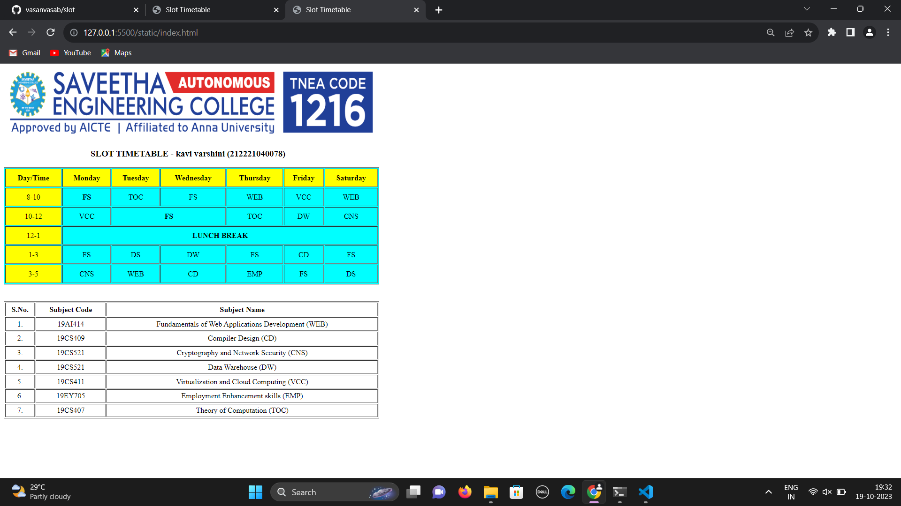

# Ex03 Time Table

# Date: 23/09/2023

## AIM
To write a html webpage page to display your slot timetable.

## ALGORITHM
### STEP 1
Create a Django-admin Interface.

### STEP 2
Create a static folder and inert HTML code.

### STEP 3
Create a simple table using ```<table>``` tag in html.

### STEP 4
Add header row using ```<th>``` tag.

### STEP 5
Add your timetable using ```<td>``` tag.

### STEP 6
Execute the program using runserver command.

## CODE
```html
<!DOCTYPE html>
<html lang="en">
<head>
    <meta charset="UTF-8">
    <meta name="viewport" content="width=device-width, initial-scale=1.0">
    <title>Slot Timetable</title>
    <style>
        .table1{
            background-color: cyan;
            border-color: gray;
            text-align: center;
            width: 800px;
            height: 250px;
        }
        .table2{
            border-color: gray;
            text-align: center;
            width: 800px;
            height: 250px; 
        }
        .name{
            padding-left: 185px;
        }
        .row1{
            background-color: yellow;
        }
        .c1{
            background-color: yellow;
        }
    </style>
</head>
<body>
    
    <h3 class = "name">SLOT TIMETABLE - kavi varshini (212221040078)</h3>
    <table border="1" class = "table1">
        <tr class = "row1">
            <th class="c1">Day/Time</th>
            <th>Monday</th>
            <th>Tuesday</th>
            <th>Wednesday</th>
            <th>Thursday</th>
            <th>Friday</th>
            <th>Saturday</th>
        </tr>
        <tr>
            <td class="c1">8-10</td>
            <th colspan="1">FS</th>
            <td>TOC</td>
            <td>FS</td>
            <td>WEB</td>
            <td>VCC</td>
            <td>WEB</td>
        </tr>
        <tr>
            <td class="c1">10-12</td>
            <td>VCC</td>
            <th colspan="2">FS</th>
            <td>TOC</td>
            <td>DW</td>
            <td>CNS</td>
            
        </tr>
        <tr>
            <td class="c1">12-1</td>
            <th colspan="6">LUNCH BREAK</th>
        </tr>
        <tr>
            <td class="c1">1-3</td>
            <td>FS</td>
            <td>DS</td>
            <td>DW</td>
            <td>FS</td>
            <td>CD</td>
            <td>FS</td>
            
        </tr>
        <tr>
            <td class="c1">3-5</td>
            <td>CNS</td>
            <td>WEB</td>
            <td>CD</td>
            <td>EMP</td>
            <td>FS</td>
            <td>DS</td>
        </tr>
    </table>
    <br>
    <br>
    <table border="1" class="table2">
        <tr>
            <th>S.No.</th>
            <th>Subject Code</th>
            <th>Subject Name</th>
        </tr>
        <tr>
            <td>1.</td>
            <td>19AI414</td>
            <td>Fundamentals of Web Applications Development (WEB)</td>
        </tr>
        <tr>
            <td>2.</td>
            <td>19CS409</td>
            <td>Compiler Design (CD)</td>
        </tr>
        <tr>
            <td>3.</td>
            <td>19CS521</td>
            <td>Cryptography and Network Security (CNS)</td>
        </tr>
        <tr>
            <td>4.</td>
            <td>19CS521</td>
            <td>Data Warehouse (DW)</td>
        </tr>
        <tr>
            <td>5.</td>
            <td>19CS411</td>
            <td>Virtualization and Cloud Computing (VCC)</td>
        </tr>
        <tr>
            <td>6.</td>
            <td>19EY705</td>
            <td>Employment Enhancement skills (EMP)</td>
        </tr>
        <tr>
            <td>7.</td>
            <td>19CS407</td>
            <td>Theory of Computation (TOC)</td>
        </tr>
    </table>
</body>
</html>
```


## OUTPUT




## RESULT
The program for creating slot timetable using basic HTML tags is executed successfully.
